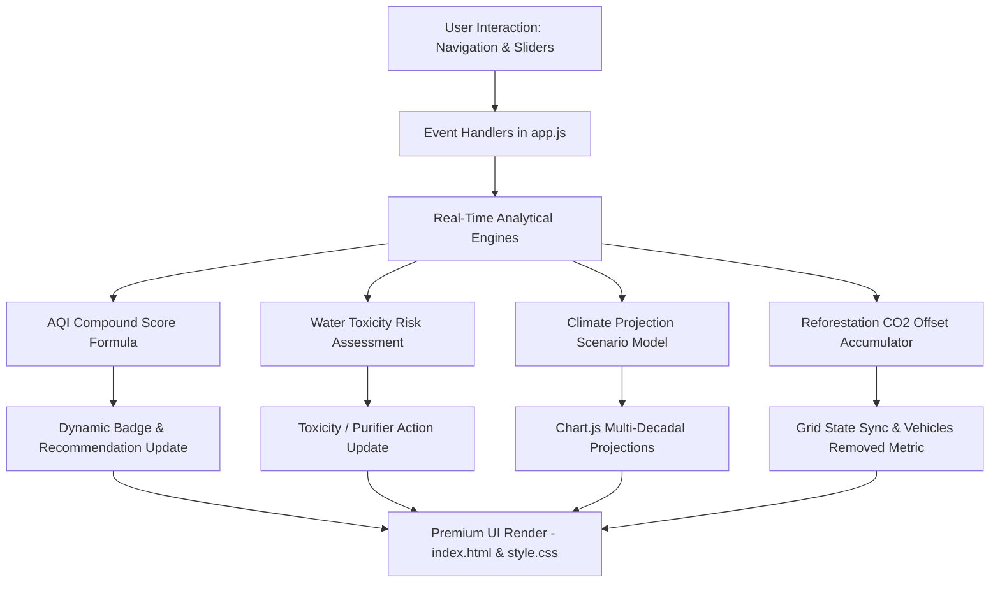
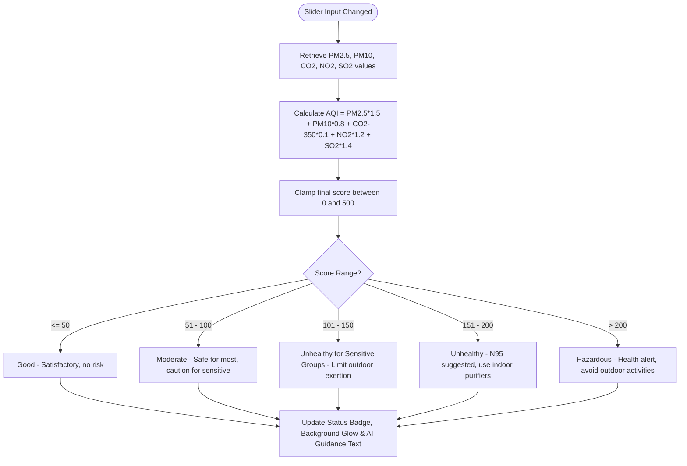
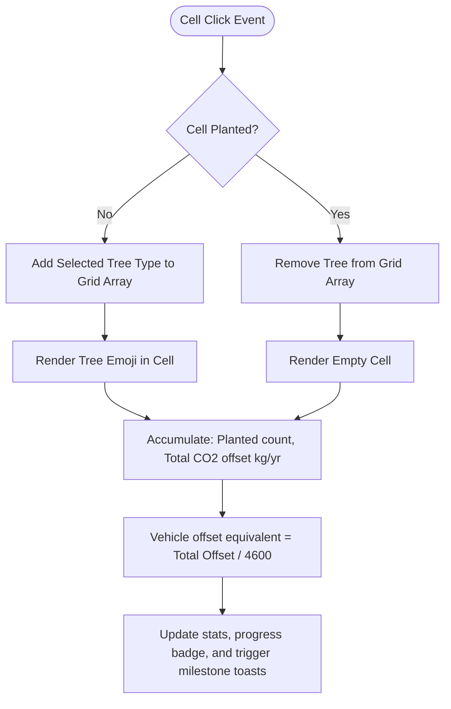

# 🌳 EcoSense AI — Environmental Monitoring Hub

EcoSense AI is a premium, real-time biosphere simulation and prediction analytics platform. Designed to offer green intelligence dashboards, it aggregates environmental markers, analyzes air and water quality sensor parameters, forecasts multi-decadal climate risk projections, and hosts an interactive reforestation planner.

---

## 🚀 Key Features

* **Interactive Biosphere Dashboard**: Displays live sensor simulations for average temperature, atmospheric carbon density, humidity, and biological stability indexes, coupled with a 6-month historical Chart.js trend visualization.
* **Air Quality (AQI) Calibration**: Simulates PM2.5, PM10, CO2, NO2, and SO2 sensor values with dynamic sliders. It computes a compound air quality index score and provides tailored AI-driven health and protective guidance.
* **Water Toxicity & Purification**: Visualizes pH, turbidity, dissolved oxygen, and lead contaminants. Features a virtual ionic purification filter that triggers active chemical neutralization and restores parameters to safe levels.
* **Multi-Decadal Climate Projections**: Projects temperature rise, sea level displacement, and extreme weather frequency up to the year 2100. Simulates IPCC-aligned emissions scenarios (SSP1-2.6, SSP2-4.5, and SSP5-8.5) across diverse sub-regions (Coastal, Urban, Forested, Arid).
* **Reforestation Planner**: Features an interactive 64-cell planting grid. Allows users to select and plant specific species (Oak, Neem, Bamboo, Pine) with custom annual CO2 absorption yields, translating offsets to passenger vehicle emissions equivalents.

---

## 📊 System Architecture & Logic Flow

### 1. General System Architecture
The application runs as a responsive single-page web app (SPA). Event handlers capture real-time slider updates and recalculate metrics instantly, updating charts and AI recommendation texts.



### 2. Air Quality Index (AQI) Calculation Logic
When sensor sliders are adjusted, the AQI is computed using a multi-factor weighting formula. The final score (0–500) determines the AQI category and triggers appropriate AI recommendations:



### 3. Tree Restoration Planner Offset Logic
The plantation planner updates carbon offsets dynamically as tree structures are added or removed on the grid:



---

## 📂 Codebase Directory Structure

```text
eco-sense-ai/
│
├── index.html       # Single-page interface with responsive layout structure
├── style.css        # Premium custom stylesheet with custom properties, glassmorphism & gradients
├── app.js           # Core client-side logic, simulators, and Chart.js integrations
├── server.ps1       # Lightweight PowerShell web server script for local testing
├── .gitignore       # Git ignores for system file structures
└── README.md        # Comprehensive documentation (this file)
```

---

## 🛠️ Getting Started & Running Locally

### Option A: Using the PowerShell Web Server (Windows)
This project includes a built-in server script (`server.ps1`) to serve the web application locally without third-party dependencies:

1. Open a PowerShell terminal.
2. Navigate to the project root directory.
3. Run the script:
   ```powershell
   .\server.ps1
   ```
   *Note: If you run into execution policy restrictions, launch the server using:*
   ```powershell
   PowerShell -ExecutionPolicy Bypass -File server.ps1
   ```
4. Open your web browser and navigate to `http://localhost:8000/`.

### Option B: Using standard HTTP Server packages
Alternatively, you can serve the directory static assets using any of the following standard utilities:

* **VS Code Live Server**: Right-click `index.html` and select **Open with Live Server**.
* **Python**: Run `python -m http.server 8000` in the directory root.
* **Node.js**: Run `npx serve` in the directory root.

---

## 📜 Specifications and Technology Stack

* **Front-End Skeleton**: HTML5 Semantic Structure
* **Styling Layer**: Vanilla CSS3 Custom design (featuring HSL tailored glow colors, dynamic grid systems, dark mode palettes, and Outfit/Inter typefaces)
* **Visualization Layer**: Chart.js (Dual-axis time-series and projected bar charts)
* **Iconography**: FontAwesome v6.4 (SVG & CSS Vector sets)
* **Simulation Engine**: Client-side JavaScript (ES6 modules and setInterval lifecycle controllers)
